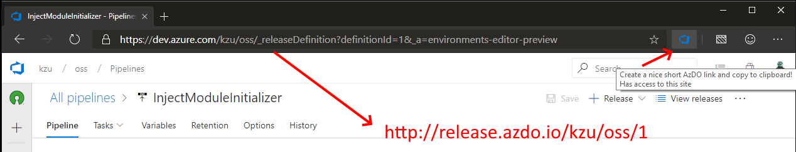

 Azure DevOps Linkinator
============
# Azure DevOps Linkinator

Usage in last 30 days:

  

# ANNOUNCEMENT

Despite being useful to some people, I haven't received a SINGLE sponsorship for this service. As such, 
I will no longer pay from my own pocket for a rather expensive domain name and accompanying Azure service.

Being OSS, of course you can host this on your own domain and Azure resources and enjoy nice URLs for your 
own projects. It was fun creating it (especially learning how to do the dynamic badges driven by AppInsights 
logs :)).

Farewell!

===========

Give [Azure DevOps](https://dev.azure.com) (a.k.a. AzDO) short, beautiful and memorable URLs with no effort.

Because [URLs are UI](https://www.hanselman.com/blog/URLsAreUI.aspx), this project provides a nicer UI on top of the default URLs provided by [Azure DevOps](https://dev.azure.com). It does so with the following two components:

* A 100% serverless URL redirection powered by [Azure Functions](http://functions.azure.com) 2.0
* A Google Chrome and [Microsoft Edge](https://www.microsoft.com/en-us/edge) [browser extension](https://browser.azdo.io/) to seamlessly create and copy the URL to the clipboard from the current [AzDO](https://dev.azure.com) page.

The latter is a must since even the most beautiful URIs are annoying to type by hand :).

## How it works:

1. Install the [browser extension](http://browser.azdo.io/) from the Chrome store.
2. Navigate to a build, release, work item or wiki page in your [AzDO](https://dev.azure.com) project.
3. Click the AzDO linkinator icon  in the browser toolbar.

1. Paste the URL you got on the clipboard and enjoy!

The following are the supported URL shortening schemes:

> NOTE: in all cases, if `org` == `project`, the latter will be omitted in the copied URL to make it even shorter.

## Builds

`https://build.azdo.io/{org}/{project}/{id}`

The ID can be either a specific ID or a build definition ID (a.k.a. pipeline ID). The linkinator will automatically redirect to the right thing.

## Releases

`http://release.azdo.io/{org}/{project}/{id}`

The ID can be either a specific release ID or a release definition ID. The linkinator will automatically redirect to the right thing.

## Work Items

`http://work.azdo.io/{org}/{project}/{id}`

## Wiki

`http://wiki.azdo.io/{org}/{project}/{path}`

## Task Groups

`http://tasks.azdo.io/{org}/{project}`

## Examples

| Short URL | Original URL |
| ------------ |-------------|
| http://work.azdo.io/WORK_ITEM_ID | https://dev.azure.com/[ORG]/[PROJECT]/_workitems/edit/[WORK_ITEM_ID] |
| http://wiki.azdo.io/Some/Subfolder/Page | https://dev.azure.com/[ORG]/[PROJECT]/_wiki/wikis/[ORG]/[PROJECT].wiki?pagePath=%2FSome%2FSubfolder%2FPage |
| https://build.azdo.io/BUILD_ID | https://dev.azure.com/[ORG]/[PROJECT]/_build/index?buildId=[BUILD_ID] |
| https://build.azdo.io/DEFINITION_ID | https://dev.azure.com/[ORG]/[PROJECT]/_build/index?definitionId=[DEFINITION_ID]&_a=completed |
| https://build.azdo.io/DEFINITION_ID | https://dev.azure.com/[ORG]/[PROJECT]/[ORG]/[PROJECT]%20Team/_build?definitionId=[DEFINITION_ID]&_a=summary
| http://release.azdo.io/DEFINITION_ID | https://dev.azure.com/[ORG]/[PROJECT]/_release?definitionId=[DEFINITION_ID]&_a=releases |
| http://release.azdo.io/DEFINITION_ID | https://dev.azure.com/[ORG]/[PROJECT]/_releaseDefinition?definitionId=[DEFINITION_ID]&_a=environments-editor-preview |
| http://release.azdo.io/RELEASE_ID | https://dev.azure.com/[ORG]/[PROJECT]/_release?releaseId=[RELEASE_ID]&_a=release-summary |
| http://release.azdo.io/RELEASE_ID | https://dev.azure.com/[ORG]/[PROJECT]/_releaseProgress?releaseId=[RELEASE_ID]&_a=release-pipeline-progress |
| http://release.azdo.io/DEFINITION_ID | https://dev.azure.com/[ORG]/[PROJECT]/_apps/hub/ms.vss-releaseManagement-web.hub-explorer?definitionId=[DEFINITION_ID]&_a=releases |
| http://release.azdo.io/RELEASE_ID | https://dev.azure.com/[ORG]/[PROJECT]/_apps/hub/ms.vss-releaseManagement-web.hub-explorer?definitionId=[DEFINITION_ID]&_a=release-summary&releaseId=[RELEASE_ID]&source=ReleaseExplorer |

## Sponsors

<h3 style="vertical-align: text-top" id="by-clarius">
&nbsp;&nbsp;by&nbsp;<a href="https://github.com/clarius">@clarius</a>&nbsp;
</h3>

*[get mentioned here too](https://github.com/sponsors/devlooped)!*
